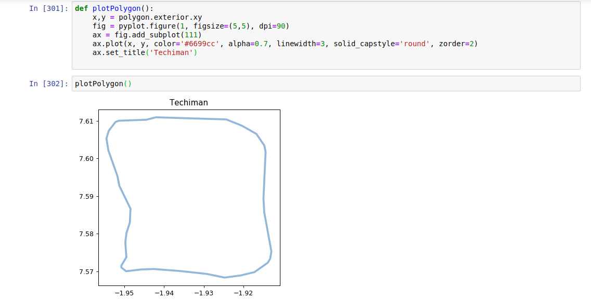

## Geo-Inferencing using Shapely

## **Overview**

Geo-Inferencing done with [Shapely](https://pypi.org/project/Shapely/) and visualizing data using [Matplotlib](https://pypi.org/project/matplotlib/)

### **Case Study**

**Client A** needs a system that's very dependent on user's location. He wants to be able to roll out services gradually starting from [Techiman](https://en.wikipedia.org/wiki/Techiman), a leading market town in South Ghana. He wants a way to restrict usage to only users within the Techiman geographical area. How then can you help him out ?
